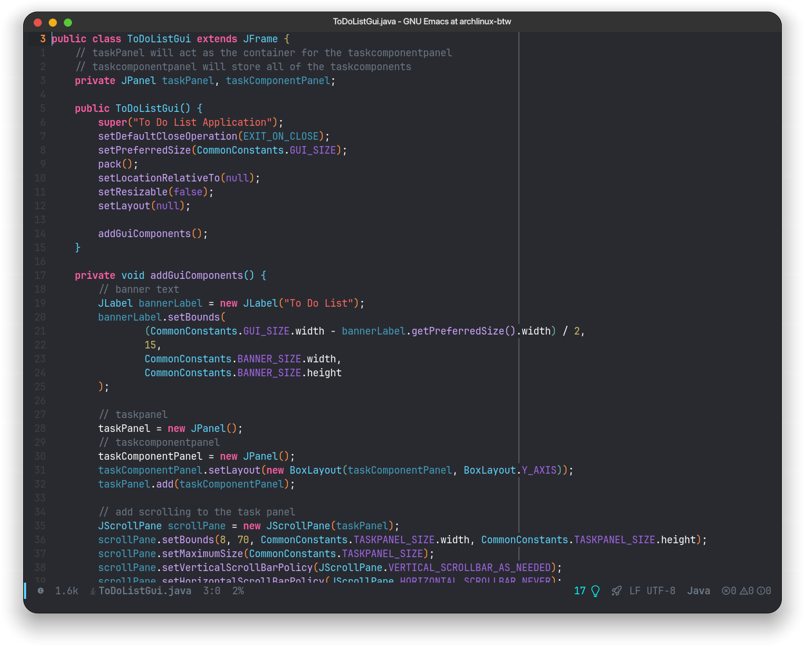

 IDEmacs
======
***it's just a config not a full distro and still in progress, and it's not supposed to work except my machine. I just want to make it a fancy github page.***

the full [GNU Emacs](https://www.gnu.org/software/emacs/) IDE configures for:

- Assembly
- C/C++
- Java
- Kotlin
- Flutter
- HTML/CSS/JS/TS
- Rust
- Python

# Features
- LSP enabled
- Tree-sitter enabled
- Rainbow brackets
- HEX colors highlight

# Installation
clone it, fork it and edit it with yourself

**Congratulations!** it will work
